# Projeto Data Master - CAPAG

## 1. Objetivo do Case

O objetivo deste case é realizar a ingestão, tratamento e visualização dos dados do arquivo CAPAG, que contém informações sobre a classificação de capacidade de pagamento dos municípios brasileiros. 

O projeto busca transformar esses dados brutos em informações valiosas, através de processos de ETL (Extract, Transform, Load) e exibição em dashboards interativos.

## 2. Arquitetura de Solução e Arquitetura Técnica

### Arquitetura de Solução

1. **Datasets**
    - Foi realizado o download dos seguintes arquivos:
        - CAPAG.txt - https://dados.gov.br/dados/conjuntos-dados/capag-municipios
        - cidades.json - https://github.com/chandez/Estados-Cidades-IBGE/blob/mster/json/municipios.json
    
    - Descrição das colunas do arquivo **CAPAG.txt**:
        | Coluna | Descrição |
        | --- | --- |
        | INSTITUICAO | Nome da instituição municipal |
        | COD_IBGE | Código IBGE da cidade |
        | UF | Unidade Federativa (Estado) |
        | POPULACAO | População do município |
        | INDICADOR_1 | Valor percentual resultante do cálculo do indicador de endividamento |
        | NOTA_1 | Classificação atribuída (A, B, C ou N.D.), para o Indicador_1 |
        | INDICADOR_2 | Valor percentual resultante do cálculo do indicador de poupança corrente |
        | NOTA_2 | Classificação atribuída (A, B, C ou N.D.), para o Indicador_2 |
        | INDICADOR_3 | Valor percentual resultante do cálculo do indicador de liquidez |
        | NOTA_3 | Classificação atribuída (A, B, C ou N.D.), para o Indicador_3 |
        | CLASSIFICACAO_CAPAG | Nota atribuída à capacidade de pagamento. Resultado da combinação das notas |
        | ANO_BASE | Ano base dos dados |

    - Descrição dos campos do arquivo **cidades.json**:
        | Campo | Descrição |
        | --- | --- |
        | Id | Identificador único da cidade |
        | Codigo | Código IBGE da cidade |
        | Nome | Nome da cidade |
        | Uf | Unidade Federativa (Estado) |

2. **Ingestão de Dados**: Os insumos foram transformados em arquivos .csv e enviados para o Google Cloud Storage.
3. **Processamento de Dados**: Os dados foram carregados no BigQuery, onde são processados e transformados em tabelas fato e dimensões, utilizando o dbt (Data Build Tool).
4. **Validação de Dados**: Foi utilizado o SODA para validar a qualidade dos dados transformados.
5. **Visualização de Dados**:  A partir de tabelas report construídas pelo dbt, os dados transformados são visualizados em dashboards interativos no Metabase.

- Pipeline completo:

   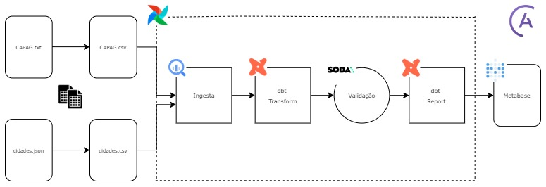


### Arquitetura Técnica

- **Docker**: Ferramenta para containerização e gerenciamento de ambientes.
- **Astro CLI**: Ferramenta de linha de comando para gerenciamento do Airflow.
- **Airflow**: Plataforma para criar, agendar e monitorar workflows, utilizada para orquestração do pipeline de dados.
- **Google Cloud Platform**: Utilizado para armazenamento e processamento dos dados.
  - **Google Cloud Storage**: Armazenamento do arquivo CAPAG e cidades.
  - **BigQuery**: Data warehouse utilizado para armazenar e processar os dados.
- **dbt (Data Build Tool)**: Ferramenta para transformação dos dados, escrita de modelos SQL e criação de tabelas no BigQuery.
- **SODA**: Ferramenta para validação e monitoramento da qualidade dos dados.
- **Metabase**: Plataforma utilizada para criar e visualizar dashboards interativos.

## 3. Explicação sobre o Case Desenvolvido

### Passo a Passo


1. **Tratamento inicial dos insumos**:
    - Primeiramente foi realizada a mudança de extensão dos datasets (CAPAG.txt e cidades.json) para .csv, para ser possível inserir no Google Cloud Storage.
    - Para isso, os seguintes comandos foram executados no terminal, criando assim os dois novos arquivos CAPAG.csv e cidades.csv:
    
      ```
      astro dev bash
      cd dags
      python json_to_csv.py
      python txt_to_csv.py
      ```


3. **Ingestão dos Arquivos**:
   - De início, os arquivos CAPAG.csv e cidades.csv foram carregados no Google Cloud Storage.
      - Para isso, foram desenvolvidas as dags _upload_capag_to_gcs_ e _upload_capag_to_gcs_.
   
   - Após esse procedimento, para receber os insumos no BigQuery, foi realizada a criação de datasets vazios (capag e cidades), através das dags _create_capag_dataset_ e _create_cidades_dataset_. 
   
   - Com isso, esses arquivos no GC Storage, foram importados no BigQuery, através das dags _gcs_to_raw_capag_ e _gcs_to_raw_cidades_, e as tabelas **capag_brasil** e **cidades_brasil** foram criadas.

4. **Criação de Tabelas transform no BigQuery com dbt**:
   - Com a criação das tabelas _capag_brasil_ e _cidades_brasil_, foi utilizado o dbt para criar modelos SQL que transformam os dados brutos em tabelas fato e dimensão.

   - As seguintes tabelas foram criadas através da dag _transform_:
      - `dim_classificacao_capag`: Contém as classificações de capacidade de pagamento.
     - `dim_instituicoes`: Contém informações das instituições (municípios).
     - `dim_uf`: Contém informações das unidades federativas.
     - `fato_indicadores`: Contém os indicadores financeiros das instituições.

   - Modelagem completa:
      
      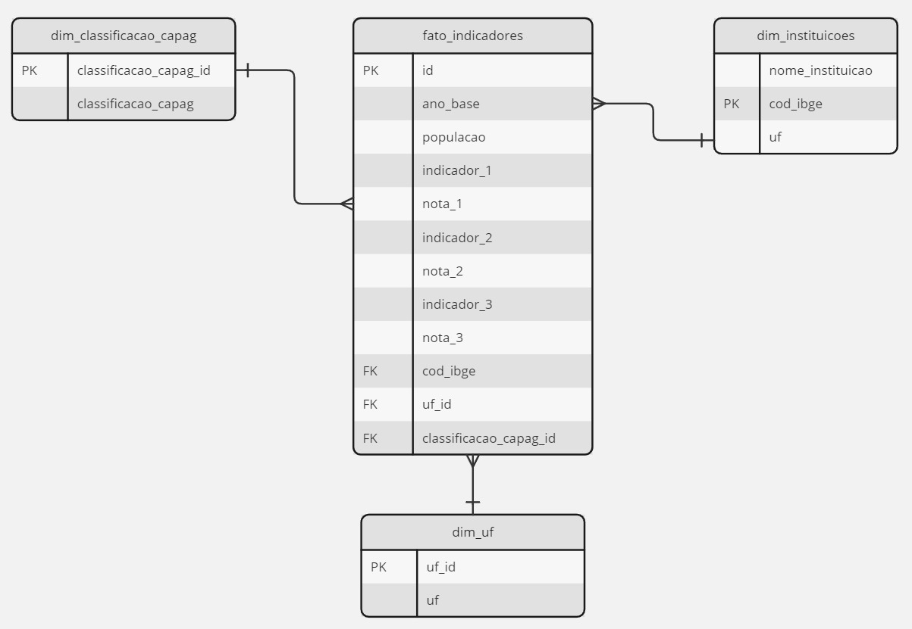


5. **Validação dos Dados com SODA**:
   - Foi configurado o SODA para verificar a qualidade dos dados transformados no BigQuery.
   - Foram realizadas validações como:
     - Validação de **formatos de dados**.
     - Verificação de **valores nulos**.
     - Verificação de **valores extremos**.
     - Validação de **dados únicos**.
   - Essa verificação da qualidade dos dados foi realizada através da dag _check_transform_, que diferente das outras dags, ela é uma tarefa do Airflow que é executada em um ambiente Python externo (_@task.external_python_), garantindo isolamento de dependências e evitando conflito com as outras tarefas.

6. **Criação de Tabelas report no BigQuery com dbt**:
   - Após a validação da qualidade dos dados das tabelas fato e dimensão, ocorre a chamada da dag _report_, que é responsável pela criação das seguintes tabelas, com o uso do dbt:

     - `report_ind1_cidades_ano`: As 10 cidades com o maior valor percentual referente ao indicador_1.
     - `report_ind2_cidades_ano`: As 10 cidades com o maior valor percentual  referente ao indicador_2.
     - `report_ind3_cidades_ano`: As 10 cidades com o maior valor percentual  referente ao indicador_3.
      - `report_classificacao_uf`: Os 10 estados brasileiros com o maior número de cidades com classificação capag como A.


7. **Criação de Dashboard no Metabase**:
   - Por fim, foi conectado o Metabase ao BigQuery e criado um dashboard interativo para visualização dos dados.
   
   - Tendo como base as tabelas report criadas, foram construídos 4 gráficos e incluídos no dashboard CAPAG:
      - `TOP 10 Cidades x Indicador_1`: Gráfico de barra que demonstra as 10 cidades com os maiores percentuais de **endividamento**, trazendo também de forma interativa o estado (unidade federativa) que se encontram e o ano base da ocorrência desse indicador.
     - `TOP 10 Cidades x Indicador_2`: Gráfico de barra que demonstra as 10 cidades com os maiores percentuais de **poupança corrente**, trazendo também de forma interativa o estado (unidade federativa) que se encontram e o ano base da ocorrência desse indicador.
     - `TOP 10 Cidades x Indicador_3`: Gráfico de barra que demonstra as 10 cidades com os maiores percentuais de **liquidez**, trazendo também de forma interativa o estado (unidade federativa) que se encontram e o ano base da ocorrência desse indicador.
     - `TOP 10 Estados Nota A`: Gráfico de pizza que mostra os 10 estados brasileiros com o maior número de cidades com **classificação capag como A**.

   - Dashboard completo:

      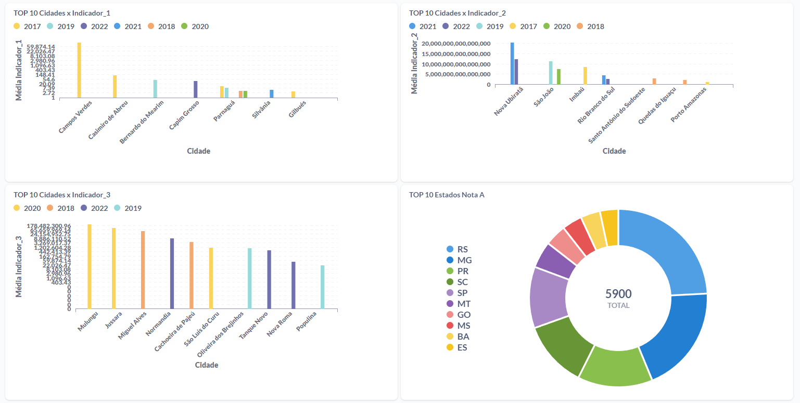


## 4. Reprodução do Case

### Pré-requisitos:
- 16GB RAM
- Docker
- Astro CLI
- Conta na plataforma SODA
- Conta no Google Cloud


### Inicialização do ambiente:
- Antes de tudo, deve-se abrir o Docker Desktop, para iniciar o Docker Engine.
- Após isso, ao importar o projeto para um editor de código (VS Code, por exemplo), deve-se realizar o seguinte comando no terminal:

      ```
      astro dev start
      ```
      
- Este comando realiza o seguinte:
   - Inicia os containers Docker necessários para rodar o Airflow localmente.
   - Inicia o scheduler e o servidor web do Airflow.
   - Carrega as variáveis de ambiente e configurações necessárias.
   - Sincroniza automaticamente as alterações do código com os containers Docker em execução.

### Configurações do Google Cloud

- Uma das premissas para reprodução do case é ter uma conta no Google Cloud, pois é necessário alterar o nome do _project_id_ em alguns arquivos do projeto.

1. Criação de um novo projeto no Google Cloud

   - Entre no console do Google Cloud (https://console.cloud.google.com/) e crie um novo projeto:

     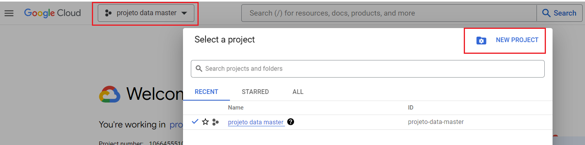
   
   - Após isso, crie um nome do campo _Project name_. Ao voltar para a tela principal do GCP, é possível ver o novo nome do _Project ID_:

     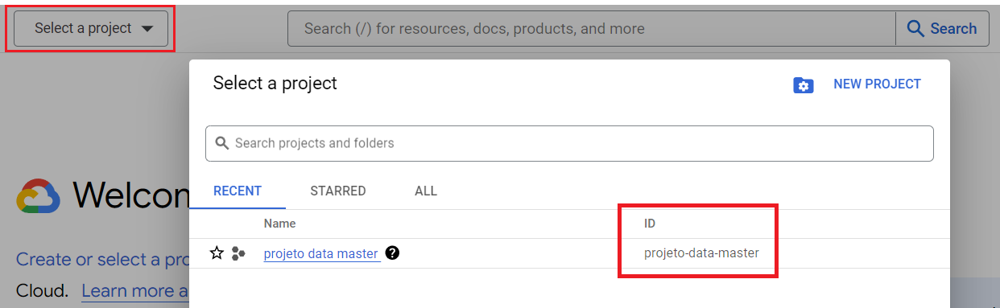
     
2. Criação de um novo Bucket

   - Após adquirir o novo project ID, é necessário criar um novo **bucket** no Google Cloud Storage para armazerar os arquivos _.csv_ criados.

     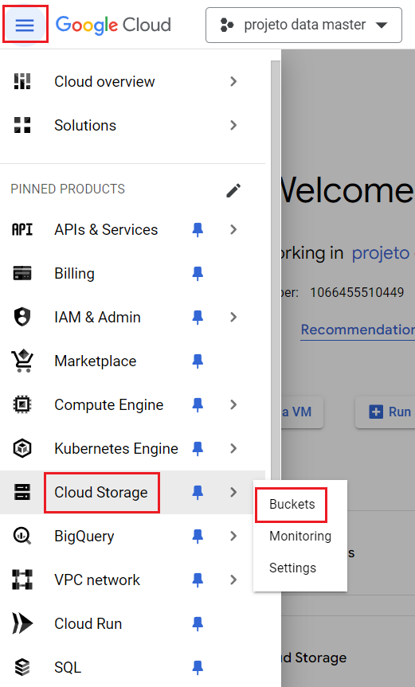

   - Após isso, clique em _Create_ e dê um nome ao novo bucket. No case, nomeei como `bruno_dm`.

3. Criação de um Service Account

   - É necessário criar um Service Account para fazer a ligação do bucket criado com o Airflow. 

     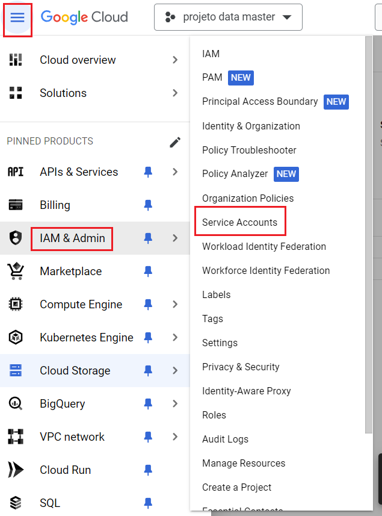

   - Após isso, clique em _Create Service Account_ e escolha um nome para ele, no case o nome escolhido foi `bruno-dm-projeto`.
   - Ao clicar em _Create and Continue_, deve-se escolher as funções do projeto, e então selecione o seguinte item:

     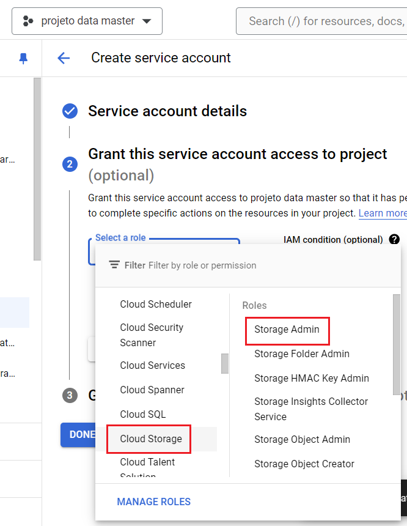


   - Depois clique em _Add Another Role_, para escolher a segunda função do projeto, e selecione a seguinte opção:

     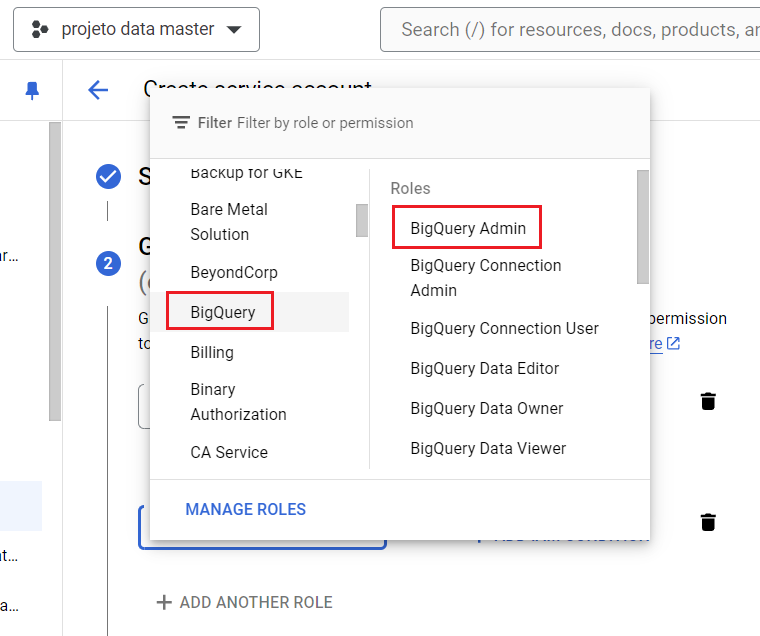

   - Com o Service Account criado, clique nele e selecione a aba _Keys_, e então clique em _Add Key_ e crie uma nova chave do  tipo JSON. Essa chave/arquivo é responsável por conectar o Google Cloud com o Airflow, para o sucesso na execução das dags:

      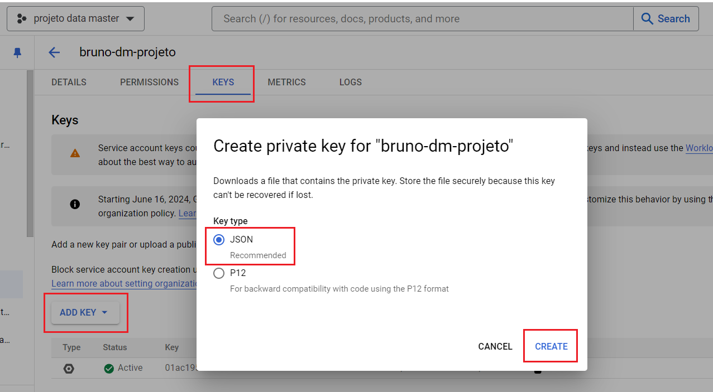
  

### Ajustes em Arquivos

   - Se o nome do projeto e o Project ID mudarem, deve-se alterar todos os arquivos do case que contenham o nome _projeto-data-master_ como Project ID.
       -  _include/dbt/profiles.yml_ - linha 8
       -  _include/dbt/models/sources/sources.yml_ - linhas 5 e 10
       -  _include/soda/configuration.yml_ - linha 9

   - Referente ao novo bucket criado, se não está com o nome "bruno_dm", o novo nome deve ser substituído no arquivo principal das dags. 
       -  _dags/capag.py_ - linhas 36, 45, 66 e 81


   - Ao gerar a key no Service Account, é gerado um arquivo para a máquina local. Esse arquivo deve sobrescrever o arquivo já existente **service_account.json**, na aba _include/gcp_.

### Ajuste SODA

   - Após realizar o login no SODA (https://www.soda.io/), deve-se pegar a chave de acesso para se conectar ao Airflow.
   - Clique no usuário no canto superior direito e depois em Profile. Na aba API Keys, adicione uma nova Key:

      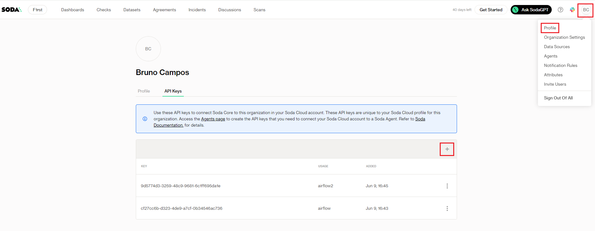
      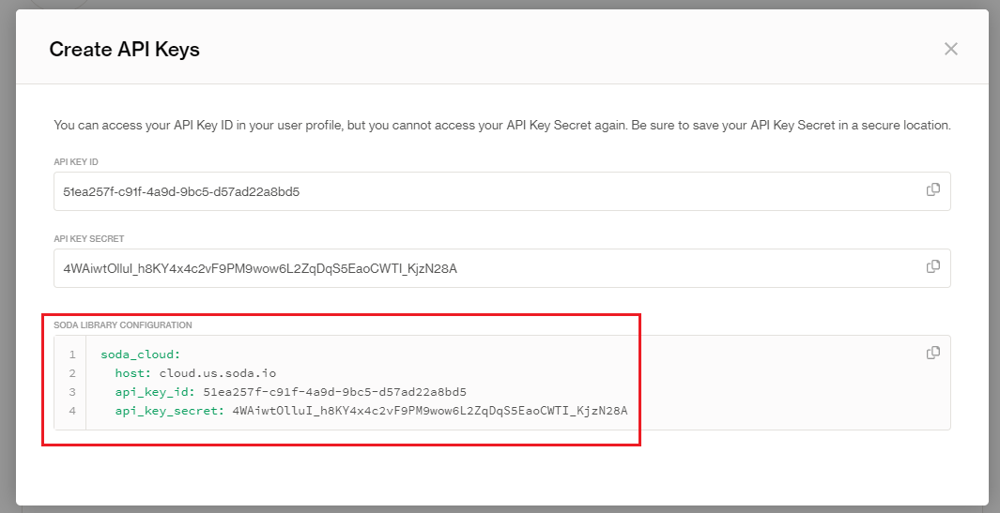

   - Essa chave gerada deve substituir as linhas de código do seguinte arquivo:
      -  _include/soda/configuration.yml_ - linhas 12, 13, 14 e 15


### Execução do Airflow

   - Deve-se incluir o novo arquivo **service_account.json** nas configurações do Airflow, para ser possível a ligação com o BigQuery. Para isso abra o navegador de sua preferencia e conecte no endereço http://localhost:8080/. Em seguida clique em Admin > Connections.
 

      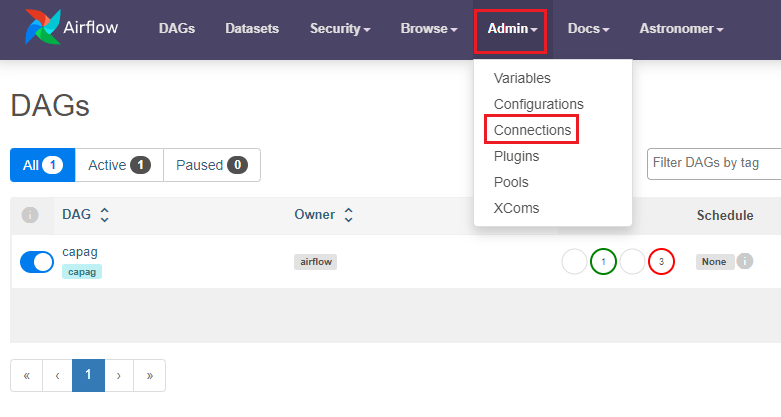


   - Com isso, crie a seguinte configuração, teste e salve:

      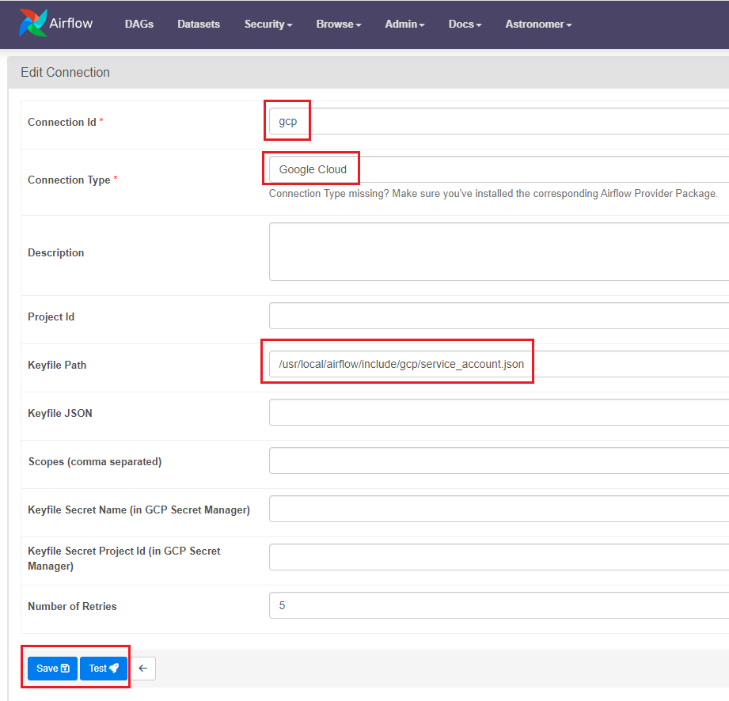


   - Após a criação da conexão com o BigQuery, é possível realizar a execução completa do projeto pelo Airflow.
   - Volte na tela principal do Airflow e clique no item **capag**:

     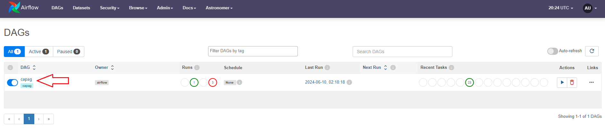
  
   - Após isso, é possível observar o grid completo das dags do projeto e executá-las.

     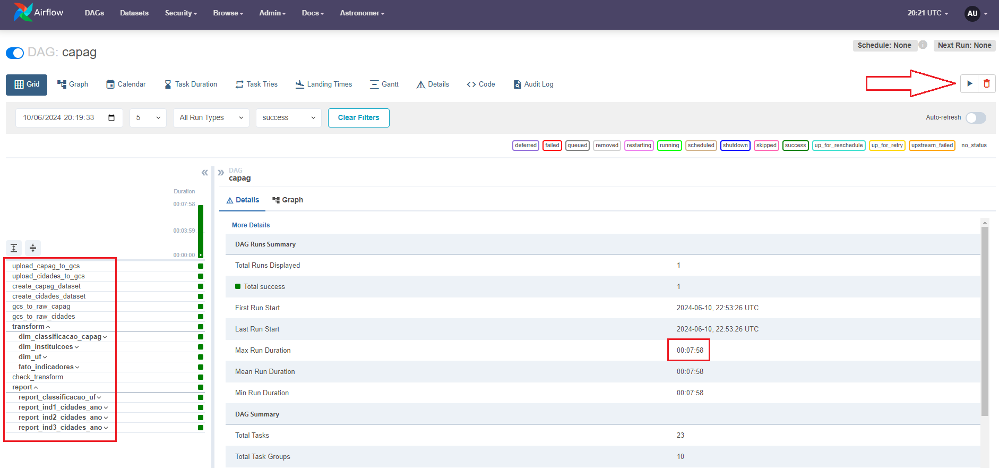

   - Uma outra alternativa interessante de visualização do projeto é o formado _Graph_, onde é possível observar a conexão entre as dags e executá-las também.

     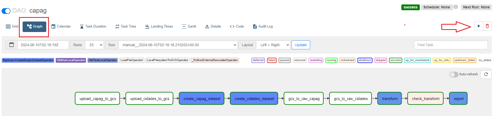


### Construção do Dashboard no Metabase

   - Como todo projeto executado com sucesso no Airflow, agora é possível criar gráficos no Metabase. 

   - Primeiramente abra o navegador de sua preferencia e conecte no endereço http://localhost:3000/. Em seguida faça um cadastro no Metabase.
   - Os gráficos apresentados no item 3.6 deste arquivo Readme foram criados após a primeira execução das dags no Airflow. Com isso, deve-se criar os mesmos gráficos para uma reprodução do case em outra máquina.
   - Após o cadastro no Metabase, é possível iniciar a criação dos gráficos. Vá para a tela principal do Metabase e clique em Novo > Pergunta:

     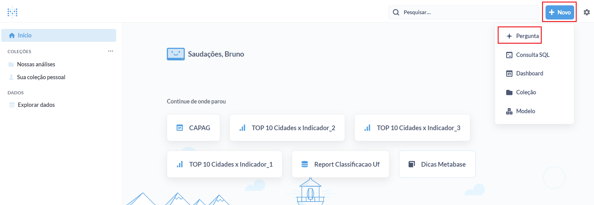

   - Em seguida, escolha a tabela report que deseja construir o gráfico. Clique em "Selecione seu dado inicial" > DW > Capag > "Report Classificacao Uf":
   
     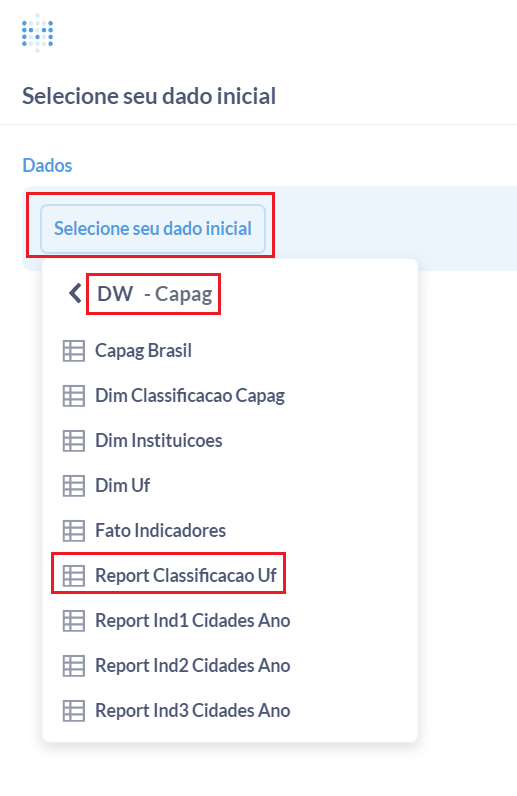

   - Após isso, clique em Visualizar > Display e escolha o gráfico mais adequado, no caso o escolhido foi o gráfico de Pizza, com as seguintes configurações:

     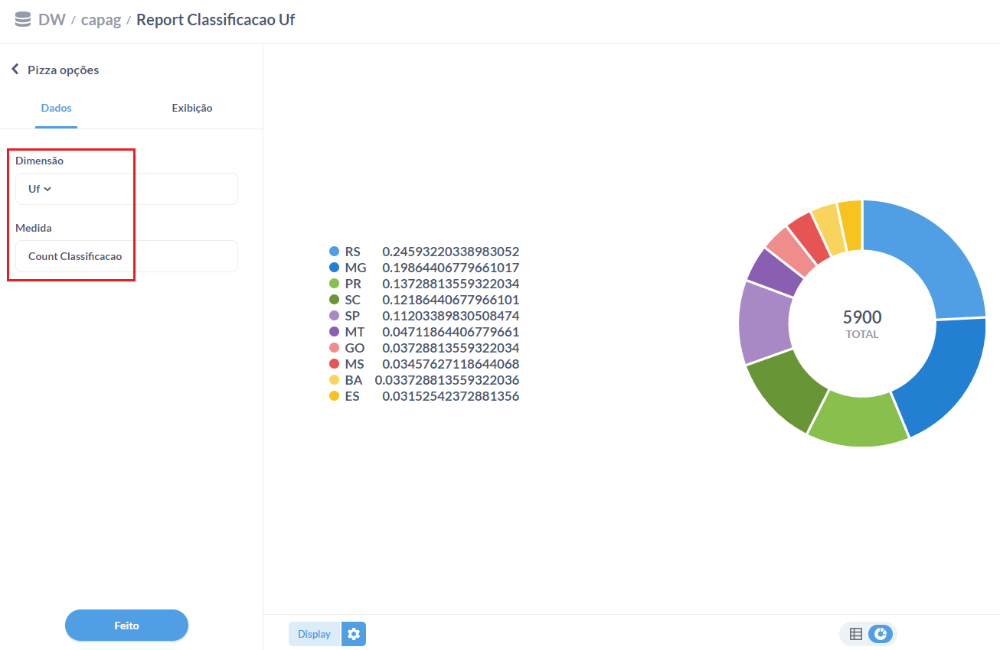
     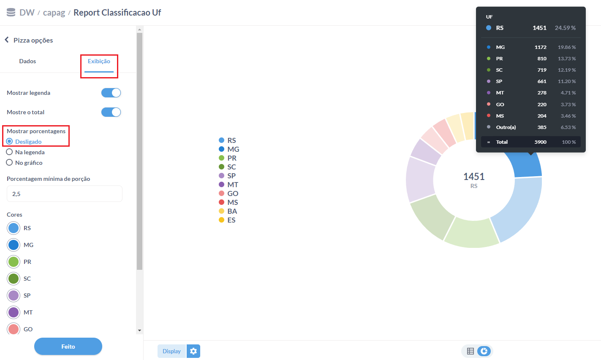

   - Para a construção do gráfico **TOP 10 Cidades x Indicador_1**, vá até a página inicial do Metabase e reinicie o processo, escolhendo o item DW > Capag > "Report Ind1 Cidades Ano". As configurações para esse gráfico devem ficar assim:

     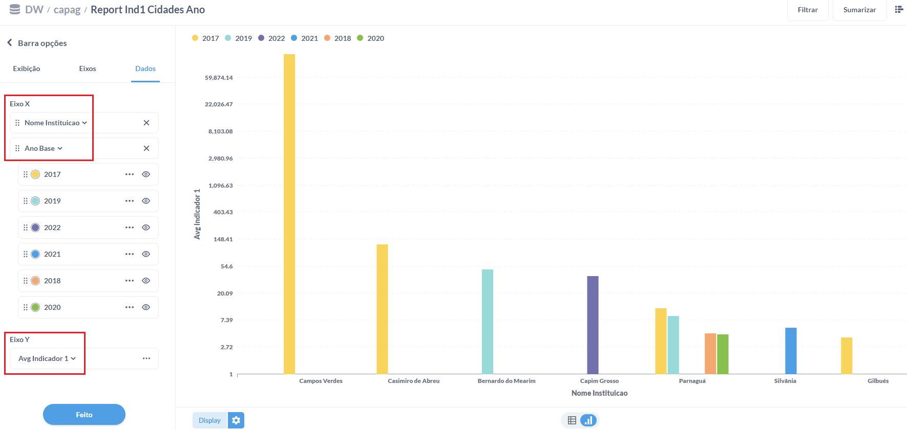
     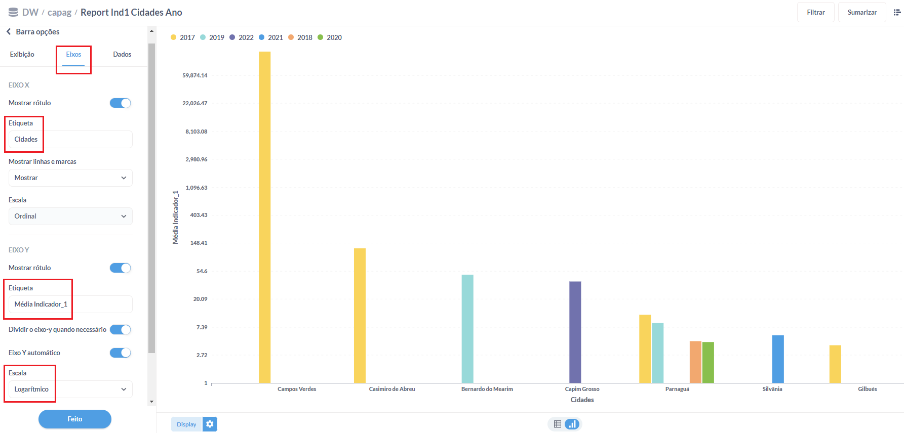

   - Para a construção dos outros dois gráficos **TOP 10 Cidades x Indicador_2** e **TOP 10 Cidades x Indicador_3**, o processo é semelhante ao do gráfico acima, referente ao Indicador_1, mudando apenas o tipo da escala (para melhor visualização dos dados), no item Eixos:
       - `TOP 10 Cidades x Indicador_2` - Eixos > Escala > **Linear**
       - `TOP 10 Cidades x Indicador_3` - Eixos > Escala > **Logarítmico**


## 5. Melhorias e Considerações Finais

### Melhorias

1. **Automação do Pipeline de Dados**:
   - Implementar uma pipeline automatizada utilizando o Airflow para gerenciar a ingestão, transformação e validação dos dados.

2. **Monitoramento Contínuo**:
   - Utilizar o SODA para configurar alertas e monitoramento contínuo da qualidade dos dados.

3. **Expansão das Visualizações**:
   - Adicionar mais tipos de visualizações no Metabase para obter insights mais profundos.
   - Incluir filtros dinâmicos para permitir uma análise mais detalhada dos dados.

### Considerações Finais

Este projeto demonstrou a capacidade de transformar dados brutos em informações valiosas através de um pipeline de ETL bem definido e ferramentas de BI poderosas. A utilização de tecnologias como BigQuery, dbt, SODA e Metabase permitiu a criação de um sistema robusto e escalável para análise de dados. As melhorias propostas visam aumentar a eficiência e a profundidade das análises, proporcionando um maior valor aos usuários finais.
